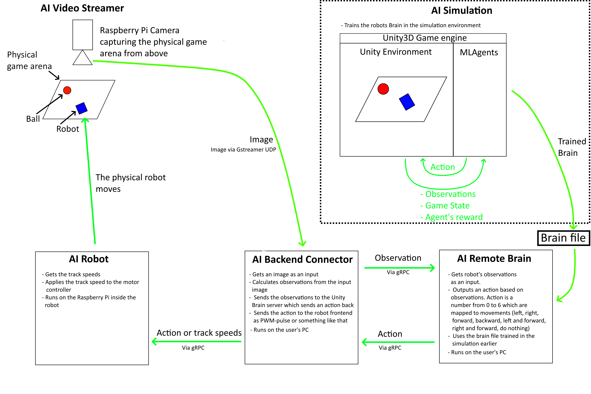

# Micro Invaders

Micro Invaders is a strategic robot battle, where two teams are playing capture the flag stylish game against each other. Each team has 2 autonomous robots. The aim is to collect energy cores, i.e. balls, into their own goals before the opponent does. The robots have access to a top down video stream that can be used to find the locations of the energy cores and robots. The robots are allowed to communicate to external computers.

In software side, there are no technology restrictions, in other words AI can be made based on rules or machine learning models. To train machine learning models in a real physical environment is often too time consuming, which is why we have built a simulation environment.

## Download and setup the project
Run the below curl-command to download 'install-project.sh'-script and run it. The script will download the project repositories and install Python dependencies if needed to virtual environments. Make sure you have the following packages installed before running the script:
- wget        (sudo apt install wget)
- git         ('sudo apt install git')
- python3     (3.6.1 or higher)
- python3-pip ('sudo apt install python3-pip')
- virtualenv  ('sudo pip3 install virtualenv')
- curl	      ('sudo apt install curl')

`curl -o- https://raw.githubusercontent.com/robot-uprising-hq/ai-guide/master/install-project.sh | bash  <(cat) </dev/tty`

## Simulation Environment

The simulation environment is designated to train agents, i.e. robots, with reinforcement learning. The simulation can also be used to test rule-based agents. The environment is built so that the same ml models, which are trained in the simulation, can be transferred to a physical environment.

The simulation is running on [Unity](https://unity.com/) (version 2019.4.8f1 LTS). The training framework is [Unity ml-agents](https://github.com/Unity-Technologies/ml-agents) (Release 6). ml-agent is based on [TensorFlow](https://www.tensorflow.org/). 

Windows 10, MacOs and Ubuntu 20 are supported.

### Components

The simulation environment consists of a few different components.

[AI Simulator](https://github.com/robot-uprising-hq/ai-simulator) includes the simulation environment. The environment is used to run the simulation, and also, it used to train the agents.

[AI Remote Brain](https://github.com/robot-uprising-hq/ai-remote-brain) is used to act as a brain of trained agents. When an agent has been trained with Unity ml-agents, the trained model is saved to a “brain file”. This repository works as a server that runs those brain files. Brain server can be used in the simulated environment and in the physical one. In simulated environment, AI Simulator hosts the simulated environment and the agents decide their actions by fetching actions from AI Remote Brain. In physical environment, AI Backend Connector fetches robot's actions from AI Remote Brain. The communicaton is happening though [gRPC](https://grpc.io/) protocol.

[AI Backend Connector](https://github.com/robot-uprising-hq/ai-backend-connector) is a critical middle piece that connects the trained model with the real world, in other words it connects AI Remote Brain with AI Robot. AI Backend Connector can also be used with the simulation. AI Backend Connector has multiplte tasks: it sends commands to robots (real or simulated), fetches actions from AI Remote Brain, and calculates the required data points such as robot coordinates by using image recognition.

[AI Video Streamer](https://github.com/robot-uprising-hq/ai-video-streamer) is used to send the video stream of the Raspberry Pi camera to AI Backend Connector. The physical game (and also simulated one) has a top down view camera that can be used to find relevant coordinates, such as locations of the robots and energy cores. This is only required if streaming through Rasberry Pi. 

[AI Robot](https://github.com/robot-uprising-hq/ai-robot) is used only in a real environment in the actual physical robot. The robot software listens to commands from AI Backend Connector, and converts the commands to motor commands. In other words, nothing intelligent is done in robot.

[AI Proto](https://github.com/robot-uprising-hq/ai-proto) has the .proto file describing the gRPC services which are used to communicate between the software parts. The .proto file is shared by the projects.

### System architecture image

